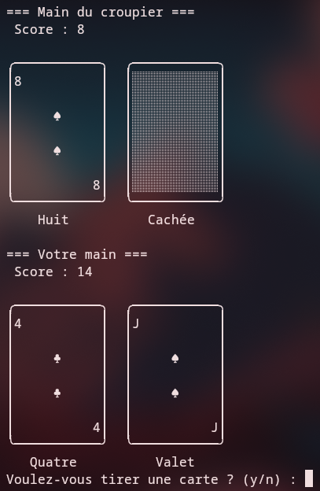
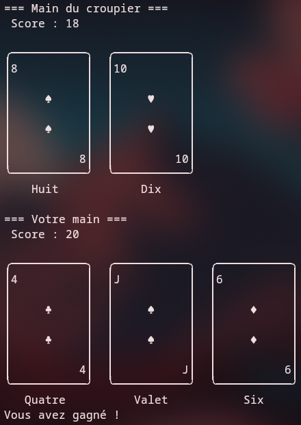

# BlackJack

Projet simple en C++ implémentant un jeu de BlackJack (console).

## Description

Ce dépôt contient une implémentation console du jeu BlackJack en C++, organisée en fichiers d'en-tête et sources. Le but est d'apprendre la conception orientée objet et la gestion d'un petit jeu en C++.

<p align="center">
  
  
</p>

## Structure du projet

- `blackjack.cpp` : point d'entrée du programme.
- `headers/` : fichiers d'en-tête (`card.hpp`, `deck.hpp`, `game.hpp`, `hand.hpp`).
- `sources/` : implémentations correspondantes (`card.cpp`, `deck.cpp`, `game.cpp`, `hand.cpp`).
- `Makefile` : cible `make` pour compiler (si présent).

## Compilation et exécution

```bash
make && ./blackjack
```
