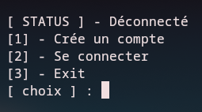
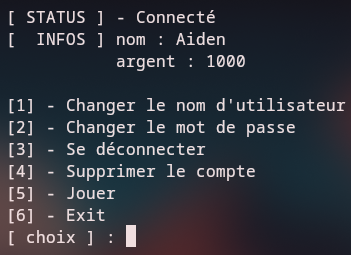

# BlackJack (C/C++)

Petit projet de jeu BlackJack écrit en C/C++.

## Description
Cette application fournit un jeu de BlackJack en ligne de commande. Le joueur joue contre le croupier. Le projet inclut une gestion simple de comptes locaux stockés dans le dossier `accounts/` (création d'utilisateurs, authentification, solde/état des parties selon l'implémentation actuelle).

L'objectif principal est d'offrir un prototype de jeu jouable en CLI, facilement compréhensible et extensible : logique de jeu séparée en modules, représentation des cartes, gestion du deck et des mains, plus une gestion basique des comptes.

<p align="center">
  
  
</p>

<p align="center">
  
  
</p>

## Fonctionnalités et prérequis
**Fonctionnalités**
- Jeu de BlackJack en ligne de commande
- Gestion des comptes (répertoire `accounts/`)
- Code séparé en modules : cartes, deck, logique du jeu, mains

**Prérequis**
- GNU Make
- Compilateur C++ moderne (g++)
- CMake (optionnel — utilisé par certains sous-modules third_party)

## Compilation
À la racine du projet, lancer :

```bash
make && ./blackjack
```

## Structure du projet
- `blackjack` / `blackjack.cpp` : point d'entrée principal
- `sources/`, `headers/` : implémentation et en-têtes (`account.cpp`, `card.cpp`, `deck.cpp`, `game.cpp`, `hand.cpp`, etc.)
- `accounts/` : fichiers de comptes (ex. `Aiden.acc`)
- `third_party/` : bibliothèques externes (bcrypt)
- `Makefile` : règles de build principales

## TODO
- Masquer la saisie du mot de passe pour que le mot de passe ne s'affiche pas à l'écran lors de la connexion/création d'un compte.
- Chiffrer les fichiers du dossier `accounts/` : actuellement les comptes sont sauvegardés en clair (facilement lisibles et modifiables).
- Une version avec interface graphique (raylib ou gtk)
- Crée un script d'installation pour :
  - crée les dossiers nécessaires avec les permissions correctes,
  - propose la création d'un premier utilisateur administrateur,
  - applique les bonnes pratiques d'emplacement plutôt que d'utiliser le répertoire du dépôt.*

